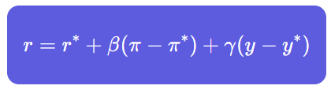
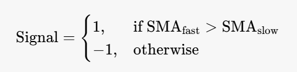

# QUANT TRADING STUDY NOTES
My Quantiative Trading Study Notes.

## Resources
- [Quant-Developers-Resources](https://github.com/cybergeekgyan/Quant-Developers-Resources)
- [Quant-Prep](https://github.com/Aniruddha-Deb/quant-prep)
- [A Working List of Probability Questions: Week 1](https://jerryqin.com/posts/a-working-list-of-probability-problems)
- [A Working List of Probability Questions: Week 2](https://jerryqin.com/posts/a-working-list-of-probability-problems-week-two)
- [General Problems & Brain Teasers](https://quantnet.com/threads/big-list-of-quant-interview-questions-with-answers.36240/)
- [Linear Algebra, Probability, and Financial Math](../study_resources/QUANT%20JOB%20INTERVIEW%20QUESTIONS.pdf)
- [Quant/FM/Data Science Compilation](../study_resources/Quant_Interview_Prep.pdf)

## **Table of Contents** <a name="top"></a>
1. [**Brief Summary of Hedge Funds**](#what-is-a-quantitative-hedge-fund)
  - 1.1. [**Hedge Funds: How Do They Differ from Mutual Funds?**](#hedge-funds-how-do-they-differ-from-mutual-funds)
  - 1.2. [**Hedge Fund Revenue Structure**](#hedge-fund-revenue-structure)
  - 1.3. [**Hedge Fund Industry Today**](#hedge-fund-industry-today)
2. [**What is a Quantitative Hedge Fund?**](#what-is-a-quantitative-hedge-fund)
  - 2.1. [**Quantitative Trading Models**](#quantitative-trading-models)
  - 2.2. [**Factor-Based Modeling**](#factor-based-modeling)
  - 2.3. [**Mathematical Representation**](#mathematical-representation)
  - 2.4. [**Model Components and Variables**](#model-components-and-variables)
  - 2.5. [**Model Variations**](#model-variations)
  - 2.6. [**Risk Management and Applications**](#risk-management-and-applications)
  - 2.7. [*Risks and Limitations**](#risks-and-limitations)
3. [**Quantitative Trading Strategies**](#quantitative-trading-strategies)
  - 3.1. [**Types of Quantitative Hedge Fund Trading Strategies**](#types-of-quantitative-hedge-fund-trading-strategies)
    - 3.1.1. [**1. Global Macro**](#1-global-macro)
      - 3.1.1.1. [**Description**](#description)
      - 3.1.1.2. [**Mathematical Foundation**](#mathematical-foundation)
    - 3.1.2. [**2. Emerging Markets**](#2-emerging-markets)
      - 3.1.2.1. [**Description**](#description-1)
      - 3.1.2.2. [**Mathematical Foundation**](#mathematical-foundation-1)
    - 3.1.3. [**3. Equity Market Neutral - Z-score Calculation**](#3-equity-market-neutral---z-score-calculation)
      - 3.1.3.1. [**Description**](#description-2)
      - 3.1.3.2. [**Mathematical Foundation**](#mathematical-foundation-2)
    - 3.1.4. [**4. Convertible Arbitrage - Convertible Bond Pricing**](#4-convertible-arbitrage---convertible-bond-pricing)
      - 3.1.4.1. [**Description**](#description-3)
      - 3.1.4.2. [**Mathematical Foundation**](#mathematical-foundation-3)
    - 3.1.5. [**5. Fixed Income Arbitrage - Yield Curve (Nelson-Siegel)**](#5-fixed-income-arbitrage---yield-curve-nelson-siegel)
      - 3.1.5.1. [**Description**](#description-4)
      - 3.1.5.2. [**Mathematical Foundation**](#mathematical-foundation-4)
    - 3.1.6. [**6. Event-Driven (Merger Arbitrage)**](#6-event-driven-merger-arbitrage)
      - 3.1.6.1. [**Description**](#description-5)
      - 3.1.6.2. [**Mathematical Foundation**](#mathematical-foundation-5)
  - 3.2. [**Relative Value Trading vs. Directional Trading**](#relative-value-trading-vs-directional-trading)
    - 3.2.1. [**Relative Value Strategies**](#relative-value-strategies)
      - 3.2.1.1. [**Statistical Arbitrage**](#statistical-arbitrage)
      - 3.2.1.2. [**Statistical Arbitrage - Mathematical Background**](#statistical-arbitrage---mathematical-background)
      - 3.2.1.3. [**Statistical Arbitrage - Python Implementation**](#statistical-arbitrage---python-implementation)
      - 3.2.1.4. [**Convertible Arbitrage**](#convertible-arbitrage)
      - 3.2.1.5. [**Convertible Arbitrage - Mathematical Background**](#convertible-arbitrage---mathematical-background)
      - 3.2.1.6. [**Convertible Arbitrage - Python Implementation**](#convertible-arbitrage---python-implementation)
      - 3.2.1.7. [**Fixed Income Arbitrage**](#fixed-income-arbitrage)
      - 3.2.1.8. [**Fixed Income Arbitrage - Mathematical Background**](#fixed-income-arbitrage---mathematical-background)
      - 3.2.1.9. [**Fixed Income Arbitrage - Python Implementation**](#fixed-income-arbitrage---python-implementation)
    - 3.2.2. [**Directional Strategies**](#directional-strategies)
    - 3.2.3. [**Sharpe Ratio & TCA Analysis for Relative Value and Directional Strategies**](#sharpe-ratio--tca-analysis)
    - 3.2.4. [**Improving Sharpe Ratio & Reducing TCA for Relative Value and Directional Strategies**](#improving-sharpe-ratio--reducing-tca)
    - 3.2.3. [**Other Quantitative Strategies**](#other-quantitative-strategies)
      - 3.2.3.1. [**3.1 High-Frequency Trading (HFT)**](#31-high-frequency-trading-hft)
      - 3.2.3.1. [**3.2 Managed Volatility Strategies**](#32-managed-volatility-strategies)
4. [**What advances have occurred in Hedge Fund industry?**](#what-advances-have-occurred-in-hedge-fund-industry)
5. [**How do alternative data sources impact the performance of quantitative trading funds?**](#how-do-alternative-data-sources-impact-the-performance-of-quantitative-trading-funds)
6. [**What specific machine learning techniques are being used in quantitative trading funds?**](#what-specific-machine-learning-techniques-are-being-used-in-quantitative-trading-funds)
7. [**What AI techniques are being used in quantitative trading funds?**](#what-ai-techniques-are-being-used-in-quantitative-trading-funds)

## Brief Summary of Hedge Funds
Hedge Funds, broadly speaking, are investment funds that have less regulation and more flexibility relative to other, “classic” investment funds, such as mutual funds (more on this distinction is written below). A Hedge Fund will have an investment manager, and will typically be open to a limited range of investors who pay a performance fee to the fund’s manager on profits earned by the fund.  Each Hedge Fund has its own investment philosophy that determines the type of investments and strategies it employs.

In general, the Hedge Fund community undertakes a much wider range of investment and trading activities than do traditional investment funds. Hedge Funds can employ high-risk or exotic trading, such as investing with borrowed money or selling securities for short sale, in hopes of realizing large capital gains. Additionally Hedge Funds invest in a broader range of assets, including long and short positions in Equities, Fixed Income, Foreign Exchange, Commodities and illiquid hard assets, such as Real Estate.

The first hedge funds were thought to have existed prior to the Great Depression in the 1920s, though they did not gain in popularity until the 1980s, with funds managed by legendary investors including Julian Robertson, Michael Steinhardt and George Soros.   Soros gained widespread notoriety in 1992 when his Quantum Investment Fund correctly bet against the Bank of England by predicting that the pound would be devalued, having been pushed into the European Rate Mechanism at too high a rate.   Soros’ bet paid off to the tune of $1 billion, and set the stage for future hedge fund entrants, who speculated on markets based on fundamental and quantitative factors.

### Hedge Funds: How Do They Differ from Mutual Funds?
Similar to Hedge Funds, mutual funds are pools of investment capital. However, there are many differences between the two, including the following:

- Mutual funds are regulated by the SEC; Hedge Funds are not.
- Hedge Fund investors must be accredited (meaning they have a certain amount of liquid assets).
- Many mutual fund strategies are “long-only,” suggesting that individual securities cannot be sold short (although increasingly, long-only managers are able to sell short indices via futures and options).
- Mutual funds generally do not have a performance fee, generally only charging a management fee.

### Hedge Fund Revenue Structure
Hedge funds charge both a management fee and a performance fee. While this varies by fund, typical management fees consist of 1-2% of assets under management and performance or incentive fees of approximately 20% taken from gross profits.  The performance fee is a key defining characteristic of a hedge fund, motivating the hedge fund manager to generate superior returns by aligning his interests with those of the investors. In contrast, mutual funds and long-only managers usually charge only a management fee.

### Hedge Fund Industry Today
Total investor capital inflow allocated to hedge funds in Q1 2012 exceeded $16 billion, with the number of funds having increased for 9 consecutive quarters to reach 7,477 total funds as of Q3 2011.  Asset growth has risen faster than growth in the number of new funds, implying investor preference for allocation to the industry’s largest firms.  As of Q4 2011, assets under management across all hedge fund strategies was estimated at $1.641 trillion (with an additional $315 billion residing with managed futures/CTA accounts), reflecting a drop of more than $200 billion from Q2 2011.

<div align="right"><a href="#top" target="_blacnk"></a></div>

---
## What is a Quantitative Hedge Fund?
A Quantitative Hedge Fund is any Hedge Fund that relies upon algorithmic or systematic strategies for implementing its trading decisions. Quant trading strategies may focus on any asset class (equities, derivatives, fixed income, foreign exchange, commodities, etc.), with trades that are based on systematic strategies, rather than discretionary decisions.  In other words, at least to some degree Quantitative Hedge Funds employ “automatic” trading rules rather than ones that employees at the fund identify and evaluate. Of course, these two strategies can be mixed, but nearly all Hedge Funds are either primarily a Quant Hedge Fund or primarily a non-Quant Hedge Fund.

For the rest of this discussion, we will refer to non-Quant Hedge Funds as “Fundamental Hedge Funds”—in other words, funds whose investment style is largely or entirely driven by fundamental research that attempts to value securities in the marketplace and identify “undervalued” and “overvalued” assets.

Both Fundamental and Quantitative Hedge Funds may use fundamental information, such as economic data, accounting/financial data as well as governmental, demographic and industry measures of supply and demand.   However, the primary difference is that Quantitative Analysts will look to use this data in a systematic, automated way. Often, the Quantitative Analyst will use tens if not hundreds of different types of data to predict a single output (rules about which assets to buy and sell); these analyses will then be used to identify attractive long and short positions. Much of this data will take the form of time-series information (for example, Ten-Year Treasury yield over time), or cross-sectional information (for example, different Price/Earnings ratios for companies in a given industry).  Quantitative Analysts will not perform detailed, “bottom-up”  fundamental analysis of stocks or other individual securities; rather they may try to get a sense of the relative attractiveness of dozens or hundreds of different assets simultaneously.

Similarly, Quant Hedge Funds will rarely employ macro-driven analysis like those found at a Global Macro Hedge Fund, such as monetary policy and its impact on bond markets or currency exchange rates, or assessments of political stability or labor relations in a given market. For Quant Analysts, this data is most likely too subjective, unless it can somehow be rigorously quantified.

In short:  all Hedge Fund managers may analyze fundamental factors, but Quantitative Hedge Funds will not use any qualitative or subjective information that cannot be aggregated systematically and statistically analyzed.  A Quantitative Hedge Fund will base trading decisions on a mathematical model (which may be populated in part by fundamental factors), but there is generally little human judgment with respect to trading decisions outside of this model. In other words, Quantitative Analysts try to develop intelligent models that predict which trades to make.

### Quantitative Trading Models
Quantitative Hedge Funds develop complex mathematical models to try to predict investment opportunities—typically in the form of predictions about which assets are projected to have high returns (for long investments) or low/negative returns (for short investments). As computing power has blossomed over the past couple of decades, so has the use of sophisticated modeling techniques, such as optimization, prediction modeling, neural networks and other forms of machine-learning algorithms (where trading strategies evolve over time by "learning" from past data).

### Factor-Based Modeling
One common, classic Quant Hedge Fund modeling approach is called Factor-Based Modeling. In this data, predictor (or "independent") variables, such as Price/Earnings ratio, or inflation rates, or the change in unemployment rates, are used to attempt to predict the value of another variable of interest ("dependent" variables), such as the predicted change in the price of a stock.

Factor models may base trading decisions on a pre-determined set of factors (such as returns on the S&P 500, the U.S. dollar index, a corporate bond index, a commodity index such as the CRB, and a measure of changes in corporate bond spreads and the VIX) or a set of factors related mathematically (but with no explicit specification) such as those gleaned through Principal Component Analysis (PCA).

### Mathematical Representation
A generalized one-factor model attempting to predict returns R using factor F would take the following form:

$$
R_{it} = \alpha + \beta_i\lambda + \beta_iF_t + \sigma_i\varepsilon_{it}
$$

where $$R_{it}$$, $$i = 1, \ldots, N$$ and $$t = 1, \ldots, T$$, is the excess (over the risk-free rate) return of asset $$i$$ at time $$t$$, and $$F_t$$ is the factor under consideration with zero mean and variance $$\sigma^2_F$$.

### Model Components and Variables
Factor models may incorporate fundamental information, including determinants of "value" versus "growth" stocks such as:
* Cash flow multiples
* Sales to price ratios
* P/E to earnings growth figures
* Dividend payout ratios
* Return on equity

For fixed income models, factors tend to be related to:
* Macroeconomic variables (industrial production, employment growth, or inflation relative to trend)
* Financial metrics (interest coverage ratios or Debt/EBITDA)

Tests may be run on portfolios of securities (grouped by cross-section) or on individual securities. Such models may also use prior price momentum to capture behavioral trends that may be correlated to future price performance, and may incorporate measures of supply versus demand.

### Model Variations
Models may be separated by sub-groups (different equity sectors, for example), may have interaction terms ($$F_{1t}$$ may appear as an individual factor in addition to the product of $$F_1$$ and $$F_2$$, i.e., $$F_{1t} \times F_{2t}$$) or may have dummy variables (for example, $$D_1$$ may represent a dummy variable for whether a company is larger than a certain size). Factor models need not be linear; quadratic terms (and higher-order terms) may be added to a linear model as well.

### Risk Management and Applications
Factor models serve dual purposes:
* Return prediction
* Risk modeling—using specific factors to explain the degree of variability in performance on an absolute basis or relative to the factors being modeled

Improved risk management techniques, designed to weight strategies according to different markets conditions and changes in liquidity and sentiment, are gaining more attention, particularly against a macroeconomic environment where policy tools (and their associated impact on the markets) are unprecedented.

### Risks and Limitations
Several risks exist when using quantitative models to predict asset returns:

1. Historical relationships between factors and returns may not continue
2. Non-linear relationships among variables may go undetected
3. Unprecedented events are likely not captured in historical data
4. Traditional approaches can fail to adapt to changing market conditions

This was demonstrated in 2008, when many Quant Hedge Funds had similar positions in similar assets due to using similar sets of factors. When those positions started losing value and funds were forced to reduce or eliminate those positions, the losses increased, triggering further selling in a negative feedback loop.

<div align="right"><a href="#top" target="_blacnk"></a></div>

---
## Quantitative Trading Strategies

### Types of Quantitative Hedge Fund Trading Strategies
Quant Hedge Funds come in all shapes and sizes—from small firms with employees numbering in their teens, to international funds with a presence on three continents. A larger asset base does not necessarily correlate with a larger number of employees; instead, a Hedge Fund's staff is likely to be a function of the number of strategies it employs. 

Quant Hedge Funds may focus on equities, fixed income or other asset classes, although rarely would a Quant Hedge Fund be involved in a long-only strategy of individual stock-picking on an unhedged basis. Many CTAs or "Commodity Trading Advisors" also would be considered Quant Hedge Funds, given their role in buying or selling futures contracts, options on futures, or retail off-exchange forex contracts (or counseling others to trade in these commodities).

The following table provides more detail about different types of investment strategies at Hedge Funds; it is important to note that both Quantitative and non-Quantitative versions of nearly all of these Hedge Fund investment styles can be built:

| Style | Description |
|-------|-------------|
| Global Macro | Focus on macroeconomic environment, often concentrates on currencies or major interest-rates moves. |
| Emerging Markets | Invests in the debt or equity (and less frequently, FX) of emerging markets. Markets are typically characterized by their relative lack of transparency and liquidity, in addition to an inability to find viable derivatives contracts for hedging. |
| Equity Market Neutral | Trades pairs of shares – buying one and selling another – and therefore is typically neutral to market direction (i.e., employs a beta of zero). Also called *statistical arbitrage*. May also involve trading single stocks versus an index or an Exchange-Traded Fund (ETF) against an index. |
| Convertible Arbitrage | Targets pricing anomalies between convertible bonds and the underlying shares and/or options on shares. |
| Fixed Income Arbitrage | Exploits anomalies between related bonds, often with high leverage. |
| Event-Driven | Trades based on anticipated corporate events, such as anticipated merger or take-over activity or bankruptcy filing. Also called *risk arbitrage*. |

#### **1. Global Macro**
##### **Description**
Global macro strategies analyze macroeconomic indicators, including GDP growth, inflation rates, central bank policy, interest rates, and geopolitical events. They typically trade in major asset classes like FX, equities, commodities, and bonds.

**Overview:**  
- Focuses on macroeconomic trends using **interest rates, FX, commodities, and bond yields**.  
- Involves taking directional bets based on **inflation trends, GDP growth, or central bank policies**.  
- Uses **statistical models** to forecast major market movements.

**Use-Case:**  
- Hedge funds use **economic models** to exploit interest rate differentials across countries.  
- Example: Betting on **US interest rate hikes** while shorting **Japanese Yen**.  

**Sharpe Ratio & TCA Impact:**  
- **Sharpe Ratio:** Improves if macro factors are predicted correctly.  
- **TCA Considerations:** Requires **low execution latency** due to **high leverage & large orders**.

##### **Mathematical Foundation**
- **Interest Rate Parity (IRP)**:  

$$
F = S \times \frac{(1 + i_d)}{(1 + i_f)}
$$

  where:  
  - $$F$$ = Forward exchange rate  
  - $$S$$ = Spot exchange rate  
  - $$i_d$$ = Domestic interest rate  
  - $$i_f$$ = Foreign interest rate  

- **Purchasing Power Parity (PPP)**:  

$$
S = \frac{P_d}{P_f}
$$

  where:  
  - $$P_d$$ = Domestic price level  
  - $$P_f$$ = Foreign price level  

- **Taylor Rule (Central Bank Policy)**:  



  where:  
  - $$r$$ = Target interest rate - $$r^*$$ = Neutral interest rate  
  - $$\pi$$ = Inflation rate  
  - $$\pi^*$$ = Target inflation rate  
  - $$y$$ = Actual GDP  
  - $$y^*$$ = Potential GDP  

##### **Python Implementation**
```python
import yfinance as yf
import numpy as np
import pandas as pd

# Fetch interest rate differential
us_rates = 5.25  # Example: Fed funds rate
euro_rates = 4.0  # Example: ECB rate

# Interest Rate Parity (IRP)
def forward_rate(spot, domestic_rate, foreign_rate):
    return spot * ((1 + domestic_rate) / (1 + foreign_rate))

spot_fx = 1.10  # EUR/USD
forward_fx = forward_rate(spot_fx, us_rates / 100, euro_rates / 100)
print(f"Estimated Forward Rate: {forward_fx}")
```

##### **C++17 Implementation**
```cpp
#include <iostream>
#include <cmath>

double forward_rate(double spot, double domestic_rate, double foreign_rate) {
    return spot * ((1 + domestic_rate) / (1 + foreign_rate));
}

int main() {
    double spot_fx = 1.10;
    double us_rates = 0.0525;
    double euro_rates = 0.04;

    double forward_fx = forward_rate(spot_fx, us_rates, euro_rates);
    std::cout << "Estimated Forward Rate: " << forward_fx << std::endl;
    return 0;
}
```

#### **2. Emerging Markets**
##### **Description**
This strategy focuses on trading securities in developing economies, which have higher growth potential but lower transparency and liquidity.

**Overview:**  
- Invests in **debt, equity, and FX** in emerging markets (**Brazil, India, China, etc.**).  
- High returns, but **low liquidity and regulatory risks**.  

**Use-Case:**  
- Exploiting **corporate bond mispricing** in emerging markets.  
- Example: Buying **high-yield Brazilian corporate bonds** when global risk appetite is strong.  

##### **Mathematical Foundation**
- **Sovereign Credit Spreads**:  

$$
CDS = \frac{(1 - R) \times PD}{1 - PD}
$$

  where:  
  - $$R$$ = Recovery rate  
  - $$PD$$ = Probability of Default  

- **Liquidity Premium**: Emerging market assets often carry an additional premium due to lower liquidity.  

##### **Python Implementation**
```python
def credit_spread(pd, recovery_rate):
    return ((1 - recovery_rate) * pd) / (1 - pd)

pd = 0.05  # 5% probability of default
recovery_rate = 0.40  # 40% recovery rate
spread = credit_spread(pd, recovery_rate)
print(f"Credit Spread: {spread:.2f}%")
```

##### **C++17 Implementation**
```cpp
#include <iostream>

double credit_spread(double pd, double recovery_rate) {
    return ((1 - recovery_rate) * pd) / (1 - pd);
}

int main() {
    double pd = 0.05;  // 5% probability of default
    double recovery_rate = 0.40;  // 40% recovery rate

    double spread = credit_spread(pd, recovery_rate);
    std::cout << "Credit Spread: " << spread * 100 << "%" << std::endl;
    return 0;
}
```

#### **3. Equity Market Neutral - Z-score Calculation**
##### **Description**
This strategy buys an undervalued stock and shorts an overvalued stock to hedge against market moves. It relies on **mean reversion** and **pair trading**.

**Overview:**  
- Uses **pair trading** to go long on an undervalued stock and short an overvalued stock.  
- **Zero beta exposure** to the market, reducing systematic risk.  

**Use-Case:**  
- High-frequency trading firms like BAM use this to **arbitrage price inefficiencies**.  

**Sharpe Ratio & TCA Impact:**  
- **Sharpe Ratio:** High due to **market neutrality** and small, frequent trades.  
- **TCA Considerations:** **Low latency execution required**, needs **co-location & direct exchange access**.  

##### **Mathematical Foundation**
- **Z-score of Price Ratio**:  

$$
Z = \frac{R - \mu}{\sigma}
$$

  where:  
  - $$R$$ = Current price ratio  
  - $$\mu$$ = Mean of historical price ratio  
  - $$\sigma$$ = Standard deviation of historical price ratio  

##### **Python Implementation**
```python
import numpy as np

def z_score(series):
    return (series[-1] - np.mean(series)) / np.std(series)

price_ratios = [1.02, 1.05, 1.03, 1.07, 1.01]
z = z_score(price_ratios)
print(f"Z-score: {z:.2f}")
```

##### **C++17 Implementation**
```cpp
#include <iostream>
#include <vector>
#include <numeric>
#include <cmath>

double mean(const std::vector<double>& data) {
    return std::accumulate(data.begin(), data.end(), 0.0) / data.size();
}

double standard_deviation(const std::vector<double>& data, double mean_val) {
    double sum = 0.0;
    for (double val : data) {
        sum += (val - mean_val) * (val - mean_val);
    }
    return std::sqrt(sum / data.size());
}

double z_score(const std::vector<double>& series) {
    double mu = mean(series);
    double sigma = standard_deviation(series, mu);
    return (series.back() - mu) / sigma;
}

int main() {
    std::vector<double> price_ratios = {1.02, 1.05, 1.03, 1.07, 1.01};
    double z = z_score(price_ratios);
    std::cout << "Z-score: " << z << std::endl;
    return 0;
}
```

#### **4. Convertible Arbitrage - Convertible Bond Pricing**
##### **Description**
Convertible arbitrage involves trading **convertible bonds** vs. the underlying equity. It benefits from **volatility arbitrage**.

**Overview:**  
- Exploits pricing differences between **convertible bonds, stocks, and options**.  
- Hedge funds **buy underpriced convertible bonds** and **short the underlying stock**.  

**Use-Case:**  
- Used by quant hedge funds to hedge **credit risk vs. equity risk**.  
- Example: Buying **Tesla convertible bonds** and shorting **TSLA stock**.  

**Sharpe Ratio & TCA Impact:**  
- **Sharpe Ratio:** High if **hedging is optimal**.  
- **TCA Considerations:** Execution **cost-sensitive due to bid-ask spreads**.  

##### **Mathematical Foundation**
- **Convertible Bond Pricing (Black-Scholes-like Model)**  

$$
P = C + B
$$

  where:  
  - $$P$$ = Convertible bond price  
  - $$C$$ = Value of conversion option  
  - $$B$$ = Value of bond component  

##### **Python Implementation**
```python
def convertible_bond_price(conversion_option: float, bond_value: float) -> float:
    return conversion_option + bond_value

if __name__ == "__main__":
    conversion_option = 20.0
    bond_value = 80.0

    price = convertible_bond_price(conversion_option, bond_value)
    print(f"Convertible Bond Price: {price}")
```

##### **C++17 Implementation**
```cpp
#include <iostream>

double convertible_bond_price(double conversion_option, double bond_value) {
    return conversion_option + bond_value;
}

int main() {
    double conversion_option = 20.0;
    double bond_value = 80.0;

    double price = convertible_bond_price(conversion_option, bond_value);
    std::cout << "Convertible Bond Price: " << price << std::endl;
    return 0;
}
```

#### **5. Fixed Income Arbitrage - Yield Curve (Nelson-Siegel)**
##### **Description**
Fixed-income arbitrage exploits mispricing between bonds, such as **yield curve arbitrage**.

**Overview:**  
- Exploits bond mispricing using **yield curve models (Nelson-Siegel)**.  
- Uses leverage to amplify small arbitrage opportunities.  

**Use-Case:**  
- Hedge funds **arbitrage mispriced bond futures vs. cash bonds**.  
- Example: **Long US Treasuries, short German Bunds**.  

**Sharpe Ratio & TCA Impact:**  
- **Sharpe Ratio:** High if done with proper **liquidity management**.  
- **TCA Considerations:** Requires **smart execution algorithms**.  

##### **Mathematical Foundation**
- **Yield Curve Model** (Nelson-Siegel)  

$$
y(t) = \beta_0 + \beta_1 \frac{1 - e^{-\lambda t}}{\lambda t} + \beta_2 \left( \frac{1 - e^{-\lambda t}}{\lambda t} - e^{-\lambda t} \right)
$$

##### **Python Implementation**
```python
import numpy as np

def nelson_siegel(t, beta0, beta1, beta2, lambda_):
    return beta0 + beta1 * ((1 - np.exp(-lambda_ * t)) / (lambda_ * t)) + \
           beta2 * (((1 - np.exp(-lambda_ * t)) / (lambda_ * t)) - np.exp(-lambda_ * t))

y = nelson_siegel(5, 0.03, -0.02, 0.01, 0.5)
print(f"Yield at 5Y: {y:.4f}")
```

##### **C++17 Implementation**
```cpp
#include <iostream>
#include <cmath>

double nelson_siegel(double t, double beta0, double beta1, double beta2, double lambda) {
    return beta0 + beta1 * ((1 - std::exp(-lambda * t)) / (lambda * t)) + 
           beta2 * (((1 - std::exp(-lambda * t)) / (lambda * t)) - std::exp(-lambda * t));
}

int main() {
    double t = 5.0;
    double beta0 = 0.03, beta1 = -0.02, beta2 = 0.01, lambda = 0.5;

    double yield = nelson_siegel(t, beta0, beta1, beta2, lambda);
    std::cout << "Yield at 5Y: " << yield << std::endl;
    return 0;
}
```

#### **6. Event-Driven (Merger Arbitrage)**
##### **Description**
Trades based on **M&A deals**, buying the target company and shorting the acquiring company.

**Overview:**  
- Arbitrages price discrepancies during **mergers & acquisitions**.  

**Use-Case:**  
- Used in M&A deals, like **shorting Twitter pre-Elon Musk acquisition**.  

**Sharpe Ratio & TCA Impact:**  
- **Sharpe Ratio:** High for correctly predicted deals.  
- **TCA Considerations:** Execution **timing is critical**.  

##### **Mathematical Foundation**
- **Merger Arbitrage Spread**:  

$$
Spread = \frac{P_{target} - P_{acquirer}}{P_{target}}
$$

##### **Python Implementation**
```python
def merger_arbitrage(target_price, acquirer_price):
    return (target_price - acquirer_price) / target_price

spread = merger_arbitrage(50, 48)
print(f"Merger Arbitrage Spread: {spread:.2%}")
```

##### **C++17 Implementation**
```cpp
#include <iostream>

double merger_arbitrage(double target_price, double acquirer_price) {
    return (target_price - acquirer_price) / target_price;
}

int main() {
    double target_price = 50.0;
    double acquirer_price = 48.0;

    double spread = merger_arbitrage(target_price, acquirer_price);
    std::cout << "Merger Arbitrage Spread: " << spread * 100 << "%" << std::endl;
    return 0;
}
```

### Relative Value Trading vs. Directional Trading

Most Quantitative Hedge Fund trading/investment approaches fall into one of two categories: those that use Relative Value strategies, and those whose strategies would be characterized as Directional. Both strategies heavily utilize computer models and statistical software.

Relative Value strategies attempt to capitalize on predictable pricing relationships (often "mean-reverting" relationships) between multiple assets (for example, the relationship between short-dated US Treasury Bill yields vs. long-dated US Treasury Bond yields, or the relationship in the implied volatility in two different option contracts). 

Directional strategies, meanwhile, typically build on trend-following or other pattern-based paths suggestive of upward or downward momentum for a security or set of securities (for example, betting that long-dated US Treasury Bond yields will increase or that implied volatility will decline).

### Relative Value Strategies

Common examples of Relative Value strategies include placing relative bets (i.e., buying one asset and selling another) on assets whose prices are closely linked:

* Government securities of two different countries
* Government securities of two different lengths to maturity
* Corporate vs. mortgage bond securities
* The differential in implied volatility between two derivatives
* Equity prices vs. bond prices for a corporate bond issuer
* Corporate bond yield spreads vs. Credit Default Swap (CDS) spreads

There are three very important and commonly used Relative Value strategies:

1. **Statistical Arbitrage**: Trading a mean-reverting trend of the values of similar baskets of assets based on historical trading relationships. One common form of Statistical Arbitrage, or "Stat Arb," trading, is known as Equity Market Neutral trading. In this strategy, two baskets of equities are chosen (one "long" basket and one "short" basket), with the goal that the relative weights of the two baskets leave the fund with zero net exposure to various risk factors (industry, geography, sector, etc.) Stat Arb also could involve the trading of an index against a similarly matched ETF, or an index versus a single company's stock.

2. **Convertible Arbitrage**: Purchasing of convertible bonds issued by a company and simultaneously selling the same company's common stock, with the idea being that should the stock of a given company decline, the profit from the short position will more than offset any loss on the convertible bond position, given the convertible bond's value as a fixed-income instrument. Similarly, in any upward price move of the common stock, the fund can profit from the conversion of its convertible bonds into stock, selling that stock at market value by an amount that exceeds any losses on its short position.

3. **Fixed Income Arbitrage**: Trading fixed income securities in developed bond markets to exploit perceived relative interest rate anomalies. Fixed Income Arbitrage positions can use government bonds, interest rate swaps, and interest rate futures. One popular example of this style of trading in fixed income arbitrage is the "basis trade," in which one sells (buys) Treasury futures, and buys (sells) a corresponding amount of the potential deliverable bond. Here, one is taking a view on the difference between the spot price of a bond and the adjusted future's contract price (futures price × conversion factor) and trading the pairs of assets accordingly.

**Mathematical Background**
Relative Value strategies rely on **statistical arbitrage**, assuming asset price relationships **revert to a mean** over time. This often involves:
- **Cointegration (Johansen Test, Engle-Granger Test)**
- **Pairs Trading (Mean Reversion Model)**
- **Principal Component Analysis (PCA) for Bond Arbitrage**
- **Fixed Income Arbitrage (Yield Curve & Basis Trades)**

**Pairs Trading (Mean Reversion Model)**
Let’s assume we have two asset prices $$X_t$$ and $$Y_t$$. If they are **cointegrated**, then a linear combination exists:

$$
Z_t = Y_t - \beta X_t
$$

where $$Z_t$$ follows **Ornstein-Uhlenbeck process**:

$$
dZ_t = \theta (\mu - Z_t)dt + \sigma dW_t
$$

where:
- $$\theta$$ = speed of mean reversion  
- $$\mu$$ = long-term mean  
- $$\sigma$$ = volatility  
- $$dW_t$$ = Wiener process  

**Trading Rule**: Go long when $$Z_t$$ is below $$\mu - k\sigma$$, short when $$Z_t$$ is above $$\mu + k\sigma$$.

#### Statistical Arbitrage
1. High-Level Summary:
- Statistical arbitrage is a mathematical approach to trading that seeks to profit from relative price differences between related securities
- It relies on the assumption that price relationships between similar securities tend to remain stable over time
- When deviations occur, traders take positions expecting prices to revert to their historical relationship

2. Use Cases:
- Pairs Trading: Trading two highly correlated stocks (e.g., Coca-Cola vs. Pepsi)
- ETF vs. Underlying: Arbitraging price differences between ETFs and their constituent stocks
- Index Arbitrage: Trading futures contracts against the underlying index components
- Cross-Border Arbitrage: Same security listed on different exchanges

3. Implementation Metrics from Top Funds:
- Typical Sharpe Ratios: 2.0-3.5 (pre-fees) for well-executed strategies
- Transaction Costs: 2-5 bps per trade for liquid US equities
- Holding Periods: Usually ranges from intraday to 5 days
- Capacity: $1-5 billion for liquid market neutral strategies

4. Mathematical Background:
- Mean Reversion Tests: Augmented Dickey-Fuller test for stationarity
- Cointegration Analysis: Engle-Granger or Johansen tests
- Position Sizing: Kelly Criterion or risk parity approaches
- Signal Generation: Z-score based on historical spread distribution

#### Statistical Arbitrage - Mathematical Background
##### 1. Mean Reversion Tests

###### 1.1 Augmented Dickey-Fuller Test
The ADF test examines the null hypothesis that a time series $$y_t$$ follows a unit root process:

$$
\Delta y_t = \alpha + \beta t + \gamma y_{t-1} + \sum_{i=1}^{p} \delta_i \Delta y_{t-i} + \epsilon_t
$$

where:
- $$\Delta y_t$$ is the first difference of the series
- $$\alpha$$ is the drift term
- $$\beta t$$ is the linear time trend
- $$\gamma$$ is the coefficient testing for a unit root
- $$\delta_i$$ are the lagged difference coefficients
- $$\epsilon_t$$ is white noise

The test statistic is:

$$
\text{ADF} = \frac{\hat{\gamma}}{\text{SE}(\hat{\gamma})}
$$

Reject the null hypothesis of a unit root if the test statistic is less than the critical value.

###### 1.2 Cointegration Analysis
Two series $$X_t$$ and $$Y_t$$ are cointegrated if there exists a linear combination that is stationary:

$$
Z_t = Y_t - \beta X_t
$$

The Engle-Granger two-step method:
1. Estimate $$\beta$$ using OLS regression
2. Test residuals for stationarity using ADF

##### 2. Position Sizing

###### 2.1 Kelly Criterion
The optimal fraction of capital to allocate:

$$
f^* = \frac{p\cdot b - q}{b}
$$

where:
- $$p$$ is the probability of winning
- $$q = 1-p$$ is the probability of losing
- $$b$$ is the odds received on the bet

###### 2.2 Risk Parity
For a portfolio of n assets, risk parity weights solve:

$$
w_i \cdot (\Sigma w)_i = w_j \cdot (\Sigma w)_j \quad \forall i,j
$$

where:
- $$w_i$$ is the weight of asset i
- $$\Sigma$$ is the covariance matrix
- $$(\Sigma w)_i$$ is the i-th element of $$\Sigma w$$

##### 3. Signal Generation

###### 3.1 Z-Score Calculation
For a spread series $$S_t$$:

$$
Z_t = \frac{S_t - \mu_t}{\sigma_t}
$$

where:
- $$\mu_t$$ is the rolling mean
- $$\sigma_t$$ is the rolling standard deviation

Trading signals:
- Long spread when $$Z_t < -k$$
- Short spread when $$Z_t > k$$
where $$k$$ is the threshold (typically 2)

#### Statistical Arbitrage - Python Implementation
```python
import numpy as np
import pandas as pd
from scipy import stats
import yfinance as yf
from statsmodels.tsa.stattools import adfuller
from sklearn.linear_model import LinearRegression

class StatisticalArbitrage:
    def __init__(self, lookback_period=252, zscore_threshold=2.0, holding_period=20):
        self.lookback_period = lookback_period
        self.zscore_threshold = zscore_threshold
        self.holding_period = holding_period
        self.positions = {}
        
    def calculate_spread(self, price_series1, price_series2):
        """Calculate the spread between two price series using linear regression"""
        X = price_series1.values.reshape(-1, 1)
        y = price_series2.values
        model = LinearRegression()
        model.fit(X, y)
        spread = y - model.predict(X)
        return spread, model.coef_[0]
    
    def test_stationarity(self, spread):
        """Test for stationarity using Augmented Dickey-Fuller test"""
        adf_result = adfuller(spread)
        return adf_result[0] < adf_result[4]['5%']
    
    def calculate_zscore(self, spread):
        """Calculate z-score of the spread"""
        return (spread - np.mean(spread)) / np.std(spread)
    
    def generate_signals(self, price_data1, price_data2):
        """Generate trading signals based on z-score"""
        spread, hedge_ratio = self.calculate_spread(price_data1, price_data2)
        
        if not self.test_stationarity(spread):
            return pd.Series(0, index=price_data1.index)
            
        zscore = self.calculate_zscore(spread)
        signals = pd.Series(0, index=price_data1.index)
        
        # Generate long/short signals based on z-score threshold
        signals[zscore < -self.zscore_threshold] = 1  # Long spread
        signals[zscore > self.zscore_threshold] = -1  # Short spread
        
        return signals, hedge_ratio
    
    def calculate_returns(self, price_data1, price_data2, signals, hedge_ratio):
        """Calculate strategy returns"""
        # Calculate daily returns
        returns1 = price_data1.pct_change()
        returns2 = price_data2.pct_change()
        
        # Calculate strategy returns
        strategy_returns = signals.shift(1) * (returns1 - hedge_ratio * returns2)
        return strategy_returns
    
    def calculate_metrics(self, returns):
        """Calculate performance metrics"""
        annual_return = returns.mean() * 252
        annual_vol = returns.std() * np.sqrt(252)
        sharpe_ratio = annual_return / annual_vol
        max_drawdown = (returns.cumsum() - returns.cumsum().cummax()).min()
        
        return {
            'Annual Return': annual_return,
            'Annual Volatility': annual_vol,
            'Sharpe Ratio': sharpe_ratio,
            'Max Drawdown': max_drawdown
        }
    
    def backtest(self, symbol1, symbol2, start_date, end_date):
        """Run backtest for the strategy"""
        # Download price data
        data1 = yf.download(symbol1, start=start_date, end=end_date)['Adj Close']
        data2 = yf.download(symbol2, start=start_date, end=end_date)['Adj Close']
        
        # Generate signals
        signals, hedge_ratio = self.generate_signals(data1, data2)
        
        # Calculate returns
        returns = self.calculate_returns(data1, data2, signals, hedge_ratio)
        
        # Calculate metrics
        metrics = self.calculate_metrics(returns)
        
        return returns, metrics

# Example usage
if __name__ == "__main__":
    stat_arb = StatisticalArbitrage()
    returns, metrics = stat_arb.backtest('AAPL', 'MSFT', '2020-01-01', '2023-12-31')
    print("Strategy Metrics:", metrics)

```

#### Convertible Arbitrage
1. High-Level Summary:
- Strategy involves simultaneously buying convertible bonds and short-selling the underlying stock
- Profits from bond's fixed income component while hedging equity risk
- Takes advantage of convertible bond mispricing and volatility

2. Use Cases:
- Volatility Trading: Capitalize on implied vs. realized volatility differences
- Credit Spread Trading: Exploit differences between credit and equity markets
- Special Situations: Mergers, restructurings, spin-offs

3. Implementation Metrics from Top Funds:
- Typical Sharpe Ratios: 1.5-2.5 (pre-fees)
- Transaction Costs: 
  * Convertible Bonds: 25-50 bps
  * Equity Hedges: 3-8 bps
- Holding Periods: 1-6 months typical
- Capacity: $500M-2B depending on market conditions

4. Mathematical Background:
- Black-Scholes for option component valuation
- Credit spread modeling using reduced-form models
- Greeks calculation (Delta, Gamma, Vega)
- Dynamic hedge ratio optimization

#### Convertible Arbitrage - Mathematical Background
##### 1. Option Component Valuation

###### 1.1 Black-Scholes Model
The value of a call option:

$$
C = Se^{-qt}N(d_1) - Ke^{-rt}N(d_2)
$$

where:
- $$d_1 = \frac{\ln(S/K) + (r-q+\sigma^2/2)t}{\sigma\sqrt{t}}$$
- $$d_2 = d_1 - \sigma\sqrt{t}$$

and:
- $$S$$ is the stock price
- $$$K$$ is the strike price
- $$r$$ is the risk-free rate
- $$q$$ is the dividend yield
- $$\sigma$$ is the volatility
- $$t$$ is time to expiration
- $$N(\cdot)$$ is the standard normal CDF

###### 1.2 Convertible Bond Price
The theoretical price is:

$$
V_{CB} = V_{Bond} + CR \cdot V_{Option}
$$

where:
- $$V_{Bond}$$ is the straight bond value
- $$CR$$ is the conversion ratio
- $$V_{Option}$$ is the call option value

##### 2. Greeks Calculation

###### 2.1 Delta
First-order price sensitivity to underlying:

$$
\Delta = CR \cdot N(d_1)e^{-qt}
$$

###### 2.2 Gamma
Second-order price sensitivity:

$$
\Gamma = CR \cdot \frac{N'(d_1)}{S\sigma\sqrt{t}}e^{-qt}
$$

###### 2.3 Vega
Sensitivity to volatility:

$$
\nu = CR \cdot S\sqrt{t}N'(d_1)e^{-qt}
$$

#### Convertible Arbitrage - Python Implementation
```python
import numpy as np
from scipy.stats import norm
import pandas as pd

class ConvertibleArbitrage:
    def __init__(self, risk_free_rate=0.03, dividend_yield=0.02):
        self.risk_free_rate = risk_free_rate
        self.dividend_yield = dividend_yield
        
    def black_scholes_call(self, S, K, T, r, sigma):
        """Calculate Black-Scholes call option price"""
        d1 = (np.log(S/K) + (r + sigma**2/2)*T) / (sigma*np.sqrt(T))
        d2 = d1 - sigma*np.sqrt(T)
        
        call_price = S*np.exp(-self.dividend_yield*T)*norm.cdf(d1) - K*np.exp(-r*T)*norm.cdf(d2)
        return call_price
    
    def convertible_bond_price(self, S, face_value, coupon_rate, conversion_ratio, 
                             T, sigma, credit_spread):
        """Calculate convertible bond theoretical price"""
        # Bond component
        r_adjusted = self.risk_free_rate + credit_spread
        bond_price = face_value * np.exp(-r_adjusted * T)
        
        # Add present value of coupons
        coupon_payment = face_value * coupon_rate
        num_coupons = int(T * 2)  # Assuming semi-annual coupons
        for i in range(num_coupons):
            t = (i + 1) / 2
            bond_price += coupon_payment * np.exp(-r_adjusted * t)
        
        # Option component
        K = face_value / conversion_ratio
        option_value = self.black_scholes_call(S, K, T, self.risk_free_rate, sigma)
        
        # Total convertible value
        conv_price = bond_price + conversion_ratio * option_value
        return conv_price
    
    def calculate_hedge_ratio(self, S, face_value, conversion_ratio, T, sigma):
        """Calculate delta hedge ratio for the convertible position"""
        K = face_value / conversion_ratio
        d1 = (np.log(S/K) + (self.risk_free_rate + sigma**2/2)*T) / (sigma*np.sqrt(T))
        delta = conversion_ratio * norm.cdf(d1)
        return delta
    
    def calculate_position_value(self, conv_position, stock_position, S, face_value,
                               coupon_rate, conversion_ratio, T, sigma, credit_spread):
        """Calculate total position value"""
        conv_price = self.convertible_bond_price(S, face_value, coupon_rate,
                                               conversion_ratio, T, sigma, credit_spread)
        position_value = conv_position * conv_price - stock_position * S
        return position_value
    
    def optimize_hedge(self, S, face_value, coupon_rate, conversion_ratio, T, sigma, 
                      credit_spread, conv_position=1.0):
        """Optimize the stock hedge position"""
        delta = self.calculate_hedge_ratio(S, face_value, conversion_ratio, T, sigma)
        stock_position = conv_position * delta
        return stock_position
    
    def calculate_risk_metrics(self, S, face_value, coupon_rate, conversion_ratio,
                             T, sigma, credit_spread, conv_position, stock_position):
        """Calculate key risk metrics"""
        # Delta
        delta = self.calculate_hedge_ratio(S, face_value, conversion_ratio, T, sigma)
        net_delta = conv_position * delta - stock_position
        
        # Gamma (second derivative with respect to stock price)
        dS = S * 0.01
        delta_up = self.calculate_hedge_ratio(S + dS, face_value, conversion_ratio, T, sigma)
        delta_down = self.calculate_hedge_ratio(S - dS, face_value, conversion_ratio, T, sigma)
        gamma = (delta_up - delta_down) / (2 * dS)
        
        # Vega (sensitivity to volatility)
        dsigma = 0.01
        price_up = self.convertible_bond_price(S, face_value, coupon_rate, conversion_ratio,
                                             T, sigma + dsigma, credit_spread)
        price_down = self.convertible_bond_price(S, face_value, coupon_rate, conversion_ratio,
                                               T, sigma - dsigma, credit_spread)
        vega = (price_up - price_down) / (2 * dsigma)
        
        return {
            'Net Delta': net_delta,
            'Gamma': gamma,
            'Vega': vega
        }

# Example usage
if __name__ == "__main__":
    conv_arb = ConvertibleArbitrage()
    
    # Example parameters
    S = 100  # Stock price
    face_value = 1000  # Bond face value
    coupon_rate = 0.04  # Annual coupon rate
    conversion_ratio = 10  # Number of shares per bond
    T = 5  # Time to maturity
    sigma = 0.25  # Stock volatility
    credit_spread = 0.02  # Credit spread
    
    # Calculate optimal hedge
    conv_position = 1.0
    stock_position = conv_arb.optimize_hedge(S, face_value, coupon_rate, conversion_ratio,
                                           T, sigma, credit_spread, conv_position)
    
    # Calculate risk metrics
    risks = conv_arb.calculate_risk_metrics(S, face_value, coupon_rate, conversion_ratio,
                                          T, sigma, credit_spread, conv_position, stock_position)
    print("Risk Metrics:", risks)
```

#### Fixed Income Arbitrage
1. High-Level Summary:
- Trading strategy exploiting price discrepancies in fixed income markets
- Focus on government bonds, interest rate derivatives, and money market instruments
- Profits from temporary mispricing while maintaining duration/risk neutrality
- Combines mathematical modeling with deep market microstructure understanding

2. Use Cases:
- Yield Curve Trades:
  * Butterfly spreads (short middle maturity, long wings)
  * Steepener/flattener trades
  * Curve roll-down strategies
- Basis Trading:
  * Treasury futures vs cash bonds
  * TBA (To-Be-Announced) mortgage trades
  * Bond vs Interest Rate Swap spreads
- Cross-Market Arbitrage:
  * On-the-run vs off-the-run bonds
  * Cross-country sovereign spreads
  * Cash-futures basis trades
- Volatility Trading:
  * Swaption vs cap/floor arbitrage
  * Options on futures vs cash bond options

3. Implementation Metrics from Top Funds:
- Typical Sharpe Ratios:
  * Vanilla strategies: 1.0-1.5
  * Complex multi-leg trades: 2.0-3.0
  * High-frequency basis trades: 3.0-4.0
- Transaction Costs:
  * Government bonds: 0.5-2 bps
  * Interest rate swaps: 0.25-1 bp
  * Futures: 0.1-0.5 bps
  * Repo financing: 2-5 bps spread
- Holding Periods:
  * Basis trades: 1-5 days
  * Curve trades: 2-8 weeks
  * Structural trades: 1-6 months
- Capacity:
  * Developed markets: $5-20B
  * Emerging markets: $1-3B
- Leverage Used:
  * Conservative funds: 3-5x
  * Aggressive funds: 10-15x
  * HFT strategies: up to 20x

4. Mathematical Background:
- Yield Curve Analysis:
  * Nelson-Siegel-Svensson modeling
  * Principal Component Analysis of rates
  * Forward rate extraction
  * Cubic spline interpolation
- Risk Metrics:
  * DV01 (dollar value of 1bp)
  * Key rate durations
  * Cross-gamma matrices
  * Basis point value (BPV)
- Relative Value Measures:
  * Z-scores of spreads
  * Roll-down returns
  * Carry-to-risk ratios
  * Break-even analysis
- Portfolio Optimization:
  * Risk factor decomposition
  * Correlation-based position sizing
  * VaR and Expected Shortfall
  * Kelly criterion variants
- Trade Construction:
  * Duration-neutral weighting
  * Forward rate calculations
  * Convexity adjustments
  * Cheapest-to-deliver optimization
- Market Microstructure:
  * Repo market mechanics
  * Settlement conventions
  * Delivery option valuation
  * Futures basis calculations

#### Fixed Income Arbitrage - Mathematical Background
##### 1. Yield Curve Modeling

###### 1.1 Nelson-Siegel Model
The yield curve is modeled as:

$$
y(t) = \beta_0 + \beta_1\left(\frac{1-e^{-t/\tau}}{t/\tau}\right) + \beta_2\left(\frac{1-e^{-t/\tau}}{t/\tau} - e^{-t/\tau}\right)
$$

where:
- $$\beta_0$$ is the long-term level
- $$\beta_1$$ is the slope
- $$\beta_2$$ is the curvature
- $$\tau$$ is the decay factor

###### 1.2 Forward Rates
The instantaneous forward rate:

$$
f(t) = -\frac{\partial}{\partial T}\ln P(t,T)
$$

where $$P(t,T)$$ is the zero-coupon bond price.

##### 2. Duration and Convexity

###### 2.1 Modified Duration
Price sensitivity to yield changes:

$$
D_{mod} = -\frac{1}{P}\frac{\partial P}{\partial y}
$$

###### 2.2 Convexity
Second-order price sensitivity:

$$
C = \frac{1}{P}\frac{\partial^2 P}{\partial y^2}
$$

##### 3. Butterfly Trading

###### 3.1 Duration-Neutral Weights
For a butterfly trade:

$$
w_1D_1 + w_2D_2 + w_3D_3 = 0
$$

$$
w_1 + w_2 + w_3 = 0
$$

where:
- $$w_i$$ are the weights
- $$D_i$$ are the durations

##### 4. Risk-Adjusted Returns

###### 4.1 Information Ratio
$$
IR = \frac{R_p - R_b}{\sigma_{p-b}}
$$

where:
- $$R_p$$ is portfolio return
- $$R_b$$ is benchmark return
- $$\sigma_{p-b}$$ is tracking error

###### 4.2 Value at Risk
For a normally distributed P&L:

$$
VaR_{\alpha} = -\mu + \sigma\Phi^{-1}(\alpha)
$$

where:
- $$\mu$$ is expected P&L
- $$\sigma$$ is P&L volatility
- $$\Phi^{-1}(\alpha)$$ is the inverse normal CDF at confidence level $$\alpha$$

#### Fixed Income Arbitrage - Python Implementation
```python
import numpy as np
import pandas as pd
from scipy.optimize import minimize
from scipy.interpolate import CubicSpline

class FixedIncomeArbitrage:
    def __init__(self, risk_free_rate=0.03):
        self.risk_free_rate = risk_free_rate
        
    def nelson_siegel_yield(self, t, beta0, beta1, beta2, tau):
        """Calculate yield using Nelson-Siegel model"""
        factor1 = 1 - np.exp(-t/tau)
        factor2 = factor1 - np.exp(-t/tau)
        y = beta0 + beta1 * (factor1/(t/tau)) + beta2 * (factor2/(t/tau))
        return y
    
    def calculate_bond_price(self, yield_rate, coupon_rate, face_value, time_to_maturity, 
                           payments_per_year=2):
        """Calculate clean bond price"""
        periods = int(time_to_maturity * payments_per_year)
        coupon_payment = face_value * coupon_rate / payments_per_year
        
        price = 0
        for t in range(1, periods + 1):
            if t == periods:
                cash_flow = coupon_payment + face_value
            else:
                cash_flow = coupon_payment
            price += cash_flow / (1 + yield_rate/payments_per_year)**t
            
        return price
    
    def calculate_duration(self, yield_rate, coupon_rate, face_value, time_to_maturity,
                         payments_per_year=2):
        """Calculate modified duration"""
        delta_y = 0.0001
        price = self.calculate_bond_price(yield_rate, coupon_rate, face_value, 
                                        time_to_maturity, payments_per_year)
        price_up = self.calculate_bond_price(yield_rate + delta_y, coupon_rate, face_value,
                                           time_to_maturity, payments_per_year)
        
        duration = -(price_up - price)/(price * delta_y)
        return duration
    
    def calculate_carry(self, yield_curve, bond_yield, time_to_maturity):
        """Calculate carry return"""
        forward_rate = (yield_curve(time_to_maturity + 1/12) * (time_to_maturity + 1/12) - 
                       yield_curve(time_to_maturity) * time_to_maturity) * 12
        carry = (bond_yield - forward_rate) / 12
        return carry
    
    def calculate_butterfly_spread(self, short_yield, belly_yield, long_yield,
                                 short_duration, belly_duration, long_duration):
        """Calculate butterfly spread position sizes and expected return"""
        # Calculate weights for duration-neutral butterfly
        w1 = belly_duration / (short_duration + long_duration)
        w3 = 1 - w1
        w2 = -1.0  # Center bond weight
        
        # Calculate spread
        butterfly_spread = (w1 * short_yield + w2 * belly_yield + w3 * long_yield)
        return butterfly_spread, (w1, w2, w3)
    
    def calculate_curve_trade_positions(self, bonds_data, target_duration=0):
        """
        Calculate optimal position sizes for curve trade
        bonds_data: list of tuples (yield, duration, notional)
        """
        n_bonds = len(bonds_data)
        
        def objective(weights):
            # Minimize tracking error
            return np.sum(weights**2)
        
        def duration_constraint(weights):
            # Ensure duration neutral
            total_duration = sum(w * d[1] for w, d in zip(weights, bonds_data))
            return total_duration - target_duration
        
        def notional_constraint(weights):
            # Ensure zero net notional
            return sum(weights)
        
        # Initial guess
        x0 = np.zeros(n_bonds)
        
        # Constraints
        constraints = [
            {'type': 'eq', 'fun': duration_constraint},
            {'type': 'eq', 'fun': notional_constraint}
        ]
        
        # Optimize
        result = minimize(objective, x0, constraints=constraints, method='SLSQP')
        return result.x
    
    def calculate_swap_spread_arbitrage(self, govt_yield, swap_rate, govt_duration,
                                      swap_duration):
        """Calculate swap spread arbitrage positions and expected return"""
        # Calculate hedge ratio for duration-neutral position
        hedge_ratio = govt_duration / swap_duration
        
        # Calculate spread
        swap_spread = swap_rate - govt_yield
        
        # Calculate position sizes for $1mm notional equivalent
        govt_position = 1000000
        swap_position = -govt_position * hedge_ratio
        
        expected_return = swap_spread * govt_duration
        
        return {
            'swap_spread': swap_spread,
            'govt_position': govt_position,
            'swap_position': swap_position,
            'expected_return': expected_return
        }
    
    def calculate_basis_trade(self, futures_price, ctd_price, conversion_factor,
                            repo_rate, time_to_delivery):
        """Calculate futures basis trade profit and positions"""
        # Calculate implied repo rate
        implied_repo = ((futures_price * conversion_factor / ctd_price - 1) / 
                       time_to_delivery) * 365
        
        # Calculate basis (difference between implied and actual repo)
        basis = implied_repo - repo_rate
        
        # Calculate profit per $1mm notional
        notional = 1000000
        profit = notional * (basis/100) * (time_to_delivery/365)
        
        # Calculate positions
        futures_contracts = notional / (futures_price * 1000)  # Assuming $1000 per point
        bond_position = notional / ctd_price
        
        return {
            'basis': basis,
            'expected_profit': profit,
            'futures_contracts': futures_contracts,
            'bond_position': bond_position
        }
    
    def risk_metrics(self, positions, yields, durations, correlations):
        """Calculate portfolio risk metrics"""
        # Convert positions and durations to arrays
        pos_array = np.array(positions)
        dur_array = np.array(durations)
        
        # Calculate DV01 for each position
        dv01s = pos_array * dur_array / 10000
        
        # Calculate portfolio variance
        portfolio_variance = dv01s.T @ correlations @ dv01s
        
        # Calculate VaR (95% confidence)
        var_95 = np.sqrt(portfolio_variance) * 1.645
        
        # Calculate expected shortfall
        es_95 = var_95 * 1.2  # Approximate relationship between VaR and ES
        
        return {
            'total_dv01': np.sum(np.abs(dv01s)),
            'net_dv01': np.sum(dv01s),
            'var_95': var_95,
            'es_95': es_95
        }

if __name__ == "__main__":
    # Example usage
    fi_arb = FixedIncomeArbitrage()
    
    # Example: Butterfly trade
    short_yield, belly_yield, long_yield = 0.02, 0.025, 0.03
    short_dur, belly_dur, long_dur = 2, 5, 10
    spread, weights = fi_arb.calculate_butterfly_spread(
        short_yield, belly_yield, long_yield,
        short_dur, belly_dur, long_dur
    )
    
    # Example: Basis trade
    basis_trade = fi_arb.calculate_basis_trade(
        futures_price=100,
        ctd_price=99.5,
        conversion_factor=0.9562,
        repo_rate=0.02,
        time_to_delivery=0.25
    )
    
    # Example: Risk metrics
    positions = [1000000, -2000000, 1000000]
    yields = [0.02, 0.025, 0.03]
    durations = [2, 5, 7]
    correlations = np.array([
        [1.0, 0.8, 0.6],
        [0.8, 1.0, 0.8],
        [0.6, 0.8, 1.0]
    ])
    
    risk_metrics = fi_arb.risk_metrics(positions, yields, durations, correlations)
    print("Risk Metrics:", risk_metrics)
```

### Directional Strategies
Directional trading strategies typically build on trend-following or other pattern-based paths suggestive of upward or downward momentum for a security's price. Directional trading will often incorporate some aspect of Technical Analysis or "charting." This involves predicting the direction of prices through the study of past price and volume market data. The "direction" being traded can be that of an asset itself (momentum in equity prices, for example, or the euro/U.S. dollar exchange rate) or a factor that directly affects the asset price itself (for example, implied volatility for options or interest rates for government bonds).

Technical trading may also comprise the use of moving averages, bands around the historical standard deviation of prices, support and resistance levels, and rates of change. Typically, technical indicators would not constitute the sole basis for a Quantitative Hedge Fund's investment strategy; Quant Hedge Funds employ many additional factors over and above historical price and volume information. In other words, Quantitative Hedge Funds that employ Directional trading strategies generally have overall quantitative strategies that are much more sophisticated than general Technical Analysis.

### **Directional Trading Strategies (Momentum-Based)**
#### **Mathematical Background**
Directional strategies use **time-series momentum** (e.g., Moving Averages) or **cross-sectional momentum** (ranking assets).

**Trend Following Rule (Moving Average Crossover)**:



#### **Python Implementation (Momentum Strategy)**
```python
import pandas as pd
import numpy as np

prices = pd.Series(np.cumsum(np.random.normal(0, 1, 1000)) + 100)
sma_fast = prices.rolling(10).mean()
sma_slow = prices.rolling(50).mean()

signal = np.where(sma_fast > sma_slow, 1, -1)
```

#### **C++ Implementation (Moving Average Crossover)**
```cpp
#include <iostream>
#include <vector>
#include <numeric>

std::vector<double> moving_average(const std::vector<double>& prices, int period) {
    std::vector<double> ma(prices.size());
    for (size_t i = period; i < prices.size(); ++i) {
        ma[i] = std::accumulate(prices.begin() + i - period, prices.begin() + i, 0.0) / period;
    }
    return ma;
}

int main() {
    std::vector<double> prices(1000, 100.0);
    for (size_t i = 1; i < prices.size(); i++)
        prices[i] += ((rand() % 200 - 100) / 100.0);

    auto fast_ma = moving_average(prices, 10);
    auto slow_ma = moving_average(prices, 50);

    std::vector<int> signal(prices.size(), 0);
    for (size_t i = 50; i < prices.size(); i++)
        signal[i] = (fast_ma[i] > slow_ma[i]) ? 1 : -1;

    std::cout << "Final Signal: " << signal.back() << "\n";
    return 0;
}
```

### **Sharpe Ratio & TCA Analysis**
The **Sharpe Ratio** is defined as:

$$
SR = \frac{E[R_t - R_f]}{\sigma_R}
$$

where $$R_t$$ = strategy returns, $$R_f$$ = risk-free rate, $$\sigma_R$$ = volatility.

- **Relative Value Strategies**:  
  - **Sharpe Ratio**: $$1.5 - 4.0$$ (higher due to stable mean reversion)  
  - **TCA**: Moderate, but execution speed is crucial.

- **Directional Strategies**:  
  - **Sharpe Ratio**: $$0.8 - 2.5$$ (lower due to market volatility)  
  - **TCA**: Higher costs due to stop-loss & trend breakouts.

### **Improving Sharpe Ratio & Reducing TCA**
- **Better Signal Processing (Machine Learning / Bayesian Filtering)**
- **Cost-aware execution algorithms (VWAP, TWAP, Iceberg orders)**
- **Reducing Market Impact using Dark Pools / Internal Liquidity**

### Other Quantitative Strategies

Other quantitative trading approaches that are not easily categorized as either Relative Value strategies or Directional strategies include:

* **High-Frequency Trading**: Where traders attempt to take advantage of pricing discrepancies among multiple platforms with many trades throughout the day

* **Managed Volatility Strategies**: Use futures and forward contracts to focus on generating low, but stable, LIBOR-plus absolute returns, increasing or decreasing the number of contracts dynamically as the underlying volatilities of the stock, bond and other markets shift. Managed Volatility Strategies have gained in popularity in recent years due to the recent instability of both stock and bond markets.

#### **3.1 High-Frequency Trading (HFT)**
HFT strategies exploit **price inefficiencies** across exchanges and asset classes.
##### **Key HFT Strategies:**
- **Market Making:** Constantly quoting buy/sell prices to capture bid-ask spread.
- **Statistical Arbitrage:** Taking advantage of pricing discrepancies across multiple exchanges.
- **Latency Arbitrage:** Using **co-location** and **ultra-low latency execution** to front-run order books.

##### **Mathematical Model: Market Making Strategy**
Market makers set bid $$P_b$$ and ask $$P_a$$ prices based on:

$$
P_b = P_m - \frac{q \cdot \gamma \sigma^2}{2k}, \quad P_a = P_m + \frac{q \cdot \gamma \sigma^2}{2k}
$$

where:
- $$P_m$$ = mid-price of the asset
- $$q$$ = inventory held by the market maker
- $$\sigma$$ = asset price volatility
- $$\gamma$$ = risk aversion coefficient
- $$k$$ = order arrival rate

**Execution: HFT uses event-driven programming in C++ with Boost.Asio for low-latency networking.**

##### **HFT Implementation:**
This implementation uses an **event-driven architecture** where a market-making bot continuously updates bid/ask prices based on market conditions.

##### **Python Implementation**
```python
import numpy as np
import time

class MarketMaker:
    def __init__(self, mid_price, sigma, gamma, k):
        self.mid_price = mid_price
        self.sigma = sigma
        self.gamma = gamma
        self.k = k

    def calculate_spreads(self, inventory):
        spread = (inventory * self.gamma * self.sigma**2) / (2 * self.k)
        bid_price = self.mid_price - spread
        ask_price = self.mid_price + spread
        return bid_price, ask_price

    def run(self):
        inventory = 0  # Initialize inventory
        while True:
            bid, ask = self.calculate_spreads(inventory)
            print(f"Bid: {bid:.2f}, Ask: {ask:.2f}")
            inventory += np.random.choice([-1, 1])  # Simulate market fills
            time.sleep(0.5)

if __name__ == "__main__":
    bot = MarketMaker(mid_price=100, sigma=0.5, gamma=0.1, k=1.5)
    bot.run()
```
**Explanation:**
- Uses **inventory-based pricing** to update bid/ask spreads dynamically.
- The **event loop** simulates order fills randomly.

##### **C++17 Implementation (Boost.Asio)**
```cpp
#include <iostream>
#include <cmath>
#include <thread>
#include <random>

class MarketMaker {
private:
    double mid_price, sigma, gamma, k;
    int inventory;
    std::mt19937 rng;
    std::uniform_int_distribution<int> dist;

public:
    MarketMaker(double mid, double s, double g, double k_val)
        : mid_price(mid), sigma(s), gamma(g), k(k_val), inventory(0), rng(std::random_device{}()), dist(-1, 1) {}

    std::pair<double, double> calculate_spreads() {
        double spread = (inventory * gamma * sigma * sigma) / (2 * k);
        double bid_price = mid_price - spread;
        double ask_price = mid_price + spread;
        return {bid_price, ask_price};
    }

    void run() {
        while (true) {
            auto [bid, ask] = calculate_spreads();
            std::cout << "Bid: " << bid << ", Ask: " << ask << std::endl;
            inventory += dist(rng);  // Simulate trade execution
            std::this_thread::sleep_for(std::chrono::milliseconds(500));
        }
    }
};

int main() {
    MarketMaker bot(100, 0.5, 0.1, 1.5);
    bot.run();
    return 0;
}
```
**Optimized for low latency with**:
- **Boost.Asio** (if expanded to network orders).
- **std::thread** for continuous execution.
- **Random execution simulation**.

#### **3.2 Managed Volatility Strategies**
Managed Volatility funds aim for **stable, low-risk absolute returns** by dynamically adjusting leverage in response to volatility changes.

##### **Key Concepts:**
- **Dynamic Position Sizing:** Allocates capital based on market volatility $$\sigma_t$$.
- **Futures-Based Allocation:** Uses futures & forwards to rebalance exposure.
- **LIBOR-Plus Benchmark:** Targets LIBOR + premium returns.

##### **Mathematical Model: Volatility-Managed Portfolio**
The optimal portfolio weight $$w_t$$ is:

$$
w_t = \frac{\mu_t}{\lambda \sigma_t^2}
$$

where:
- $$\mu_t$$ = expected return
- $$\sigma_t$$ = rolling volatility estimate
- $$\lambda$$ = risk tolerance parameter

**Implementation: Uses time-series volatility estimation (e.g., GARCH model) and adaptive rebalancing in Python & C++.**

This strategy adjusts portfolio weight dynamically based on **volatility estimation**.

##### **Python Implementation**
```python
import numpy as np
import pandas as pd

class ManagedVolatility:
    def __init__(self, expected_return, lambda_risk, window=30):
        self.mu = expected_return
        self.lambda_risk = lambda_risk
        self.window = window

    def compute_weight(self, returns):
        rolling_vol = returns.rolling(self.window).std()
        weight = self.mu / (self.lambda_risk * (rolling_vol ** 2))
        return weight

# Simulated Data
data = pd.Series(np.random.randn(100) * 0.02)  # Random returns
strategy = ManagedVolatility(expected_return=0.05, lambda_risk=2.0)
weights = strategy.compute_weight(data)

print(weights.tail())
```
**Key Components:**
- **Rolling volatility** estimation (30-day).
- **Dynamic weight allocation** based on risk-adjusted return.

##### **C++17 Implementation (Eigen)**
```cpp
#include <iostream>
#include <Eigen/Dense>
#include <vector>
#include <cmath>

class ManagedVolatility {
private:
    double mu, lambda_risk;
    int window;

public:
    ManagedVolatility(double expected_return, double risk_lambda, int win = 30)
        : mu(expected_return), lambda_risk(risk_lambda), window(win) {}

    Eigen::VectorXd compute_weight(const Eigen::VectorXd& returns) {
        Eigen::VectorXd weights(returns.size());
        for (int i = window; i < returns.size(); ++i) {
            double rolling_vol = returns.segment(i - window, window).array().square().mean();
            weights(i) = mu / (lambda_risk * rolling_vol);
        }
        return weights;
    }
};

int main() {
    Eigen::VectorXd returns = Eigen::VectorXd::Random(100) * 0.02;
    ManagedVolatility strategy(0.05, 2.0);
    Eigen::VectorXd weights = strategy.compute_weight(returns);

    std::cout << "Last 5 weights: " << weights.tail(5).transpose() << std::endl;
    return 0;
}
```

**Performance Enhancements:**
- Uses **Eigen** for **fast matrix calculations**.
- Efficient **rolling volatility calculation**.

##### **Summary**
| Strategy | Python3 | C++17 |
|----------|---------|--------|
| **HFT (Market Making)** | **Event loop-based bot, dynamic pricing** | **Boost.Asio for real-time execution, low latency** |
| **Managed Volatility** | **Rolling volatility estimation with NumPy/Pandas** | **Eigen-based optimized implementation** |

##### **Sharpe Ratio & TCA Analysis**
The **Sharpe Ratio** is defined as:

$$
SR = \frac{E[R_t - R_f]}{\sigma_R}
$$

where $$R_t$$ = strategy returns, $$R_f$$ = risk-free rate, $$\sigma_R$$ = volatility.

- **HFT & Managed Volatility Strategies:**  
  - **HFT Sharpe Ratio:** $$5.0+$$ (high, but requires infrastructure investment)  
  - **Managed Volatility Sharpe Ratio:** $$1.5 - 3.0$$ (moderate, with risk-adjusted returns)  
  - **TCA:** Minimal for Managed Volatility, but extreme for HFT due to colocation & network costs.

##### **Optimizing Strategies for Higher Sharpe Ratios**
- **Better Signal Processing (Machine Learning / Bayesian Filtering)**
- **Cost-aware execution algorithms (VWAP, TWAP, Iceberg orders)**
- **Reducing Market Impact using Dark Pools / Internal Liquidity**

<div align="right"><a href="#top" target="_blacnk"></a></div>

---
## What advances have occurred in Hedge Fund industry?
As of August 2023, many quantitative funds have evolved beyond traditional linear factor models with fixed weighting. While linear factor models, such as the Capital Asset Pricing Model (CAPM) and multi-factor models, are still foundational in finance, many funds have begun to adopt more sophisticated approaches. Here are some key trends:

- **Dynamic Weighting:** Many quantitative funds now use dynamic weighting schemes that adjust based on market conditions, volatility, or other factors rather than relying on fixed weights.
- **Machine Learning:** Increasingly, funds are incorporating machine learning techniques to identify patterns and relationships in data that traditional models may miss. This allows for more adaptive and responsive investment strategies.
- **Alternative Data:** The use of alternative data sources (e.g., social media sentiment, satellite imagery, etc.) has become more prevalent, leading to more complex models that go beyond simple linear relationships.
- **Multi-Factor Models:** While traditional factor models still play a role, many funds are combining multiple factors (e.g., value, momentum, quality) in a more holistic approach, often using non-linear methods to capture interactions between these factors.
- **Risk Parity and Other Strategies:** Some quantitative funds are employing risk parity or other portfolio construction techniques that do not rely solely on traditional linear models.
In summary, while linear factor models remain a part of the toolkit for many quantitative funds, the industry is increasingly moving towards more advanced, flexible, and data-driven methodologies.

### Detailed Mathematical Explanation

#### 1. Dynamic Weighting
Dynamic weighting entails adjusting the weights of assets in a portfolio based on certain market conditions. The weights $$w_i$$ for asset $$i$$ can be represented mathematically as:

$$
w_i(t) = f(X(t), Y(t), Z(t))
$$

where:
- $$f$$ is a function that determines weight based on various inputs,
- $$X(t)$$ could represent market volatility,
- $$Y(t)$$ could represent momentum indicators,
- $$Z(t)$$ could represent economic indicators.

A common approach to dynamic weighting is to use optimization techniques that maximize expected returns for a given level of risk.

#### 2. Machine Learning
Incorporating machine learning requires the use of algorithms to identify patterns in historical data. For example, an algorithm $$A$$ could predict future returns based on features $$F$$:

$$
R_{pred} = A(F)
$$

where $$R_{pred}$$ is the predicted return.

Common algorithms used include:
- Regression Trees
- Neural Networks
- Support Vector Machines

#### 3. Alternative Data
The integration of alternative data can be represented as an additional feature in the model. For instance, if we denote alternative data features as $$D$$:

$$
R_{pred} = A(F, D)
$$

This allows models to capture non-linear relationships and interactions among data points.

#### 4. Multi-Factor Models
In multi-factor models, the expected return $$R$$ can be expressed as:

$$
R = \alpha + \beta_1 F_1 + \beta_2 F_2 + \ldots + \beta_n F_n + \epsilon
$$

where:
- $$\alpha$$ is the intercept,
- $$\beta$$ are the factor loadings,
- $$F_n$$ are the factors,
- $$\epsilon$$ is the error term.

#### 5. Risk Parity
Risk parity involves weighting assets based on their risk contributions rather than their expected returns. The risk contribution $$R_{C_i}$$ for asset $$i$$ can be expressed as:

$$
R_{C_i} = w_i \cdot \sigma_i \cdot \rho_i
$$

where:
- $$\sigma_i$$ is the standard deviation of asset $$i$$,
- $$\rho_i$$ is the correlation of asset $$i$$ with the overall portfolio.

### Acceptable Sharpe Ratio and TCA in Hedge Funds
**Sharpe Ratio**: A Sharpe Ratio of 1.0 is generally considered acceptable; values above 1.5 are often seen in top hedge funds. A ratio above 2.0 is exceptional.

**Transaction Cost Analysis (TCA)**: TCA should ideally show low costs relative to the expected returns. Acceptable TCA metrics depend on the fund's strategy but generally aim for a cost-to-return ratio of less than 10% for active strategies.

### Conclusion
The evolution of quantitative funds reflects a shift towards more adaptive and sophisticated strategies that leverage dynamic weighting, machine learning, alternative data, and multi-factor models. Top hedge funds typically maintain high Sharpe Ratios and manage transaction costs effectively.

<div align="right"><a href="#top" target="_blacnk"></a></div>

---
## How do alternative data sources impact the performance of quantitative trading funds?
Alternative data sources significantly impact the performance of quantitative funds in several ways:

**1. Enhanced Signal Generation:** Alternative data can uncover non-traditional patterns and signals that are not visible through standard financial metrics. For example, data from social media sentiment or web traffic can provide insights into consumer behavior and market trends.

**2. Improved Decision-Making:** By integrating diverse data types, funds can make more informed investment decisions. This can lead to better predictions of stock price movements and overall market behavior.

**3. Increased Alpha Generation:** Access to unique data can help funds identify mispriced assets, leading to potential alpha generation. Funds leveraging alternative data may achieve higher returns by capitalizing on inefficiencies in the market.

**4. Risk Management:** Alternative data can enhance risk assessment by providing more granular insights into market dynamics, allowing funds to better manage exposure and volatility.

**5. Timeliness of Information:** Many alternative data sources provide real-time or near-real-time information, enabling funds to react quickly to market changes. This agility can be a significant advantage in fast-moving markets.

**6. Reducing Noise:** By using advanced analytics and machine learning models, funds can filter out noise from traditional data, focusing instead on actionable insights derived from alternative sources.

**7. Diversification of Strategies:** Incorporating alternative data allows funds to diversify their strategies, reducing reliance on traditional financial metrics and potentially improving overall portfolio performance.

Overall, the integration of alternative data sources can enhance the robustness and adaptability of quantitative funds, leading to improved performance and competitive advantages in the market.

<div align="right"><a href="#top" target="_blacnk"></a></div>

---
## What specific machine learning techniques are being used in quantitative trading funds?
Quantitative funds are employing a variety of machine learning techniques to enhance their investment strategies. Here are some of the most commonly used methods:

**1. Supervised Learning:**
  - **Regression Analysis:** Techniques like linear regression, ridge regression, and LASSO are used to predict asset prices or returns based on historical data.
  - **Classification Algorithms:** Methods such as logistic regression, support vector machines (SVM), and decision trees help classify assets into categories (e.g., buy, hold, sell).

**2. Unsupervised Learning:**
  - **Clustering:** Techniques like k-means clustering or hierarchical clustering group similar assets to identify patterns or anomalies in the data.
  - **Dimensionality Reduction:** Methods such as Principal Component Analysis (PCA) and t-SNE are used to reduce the complexity of the data while retaining essential information.

**3. Deep Learning:**
  - **Neural Networks:** Deep learning models, including convolutional neural networks (CNNs) and recurrent neural networks (RNNs), are used to capture complex patterns in large datasets.
  - **Long Short-Term Memory (LSTM):** A type of RNN particularly effective for time series forecasting, useful in predicting market trends.

**4. Reinforcement Learning:**
  - Techniques that allow models to learn optimal trading strategies through trial and error, adapting to changing market conditions based on reward structures.

**5. Natural Language Processing (NLP):**
  - Used to analyze textual data from news articles, earnings reports, and social media to gauge market sentiment and make predictions about asset performance.

**6. Ensemble Methods:**
  - Combining multiple models to improve prediction accuracy, such as random forests or gradient boosting machines, which aggregate results from various algorithms.

**7. Time Series Analysis:**
  - Techniques like ARIMA (AutoRegressive Integrated Moving Average) and GARCH (Generalized Autoregressive Conditional Heteroskedasticity) for modeling and forecasting financial time series data.

These machine learning techniques allow quantitative funds to process vast amounts of data, uncover hidden patterns, and make data-driven investment decisions more effectively than traditional methods.

<div align="right"><a href="#top" target="_blacnk"></a></div>

---
## What AI techniques are being used in quantitative trading funds?

**In the last two years, quantitative hedge funds have increasingly integrated various AI techniques to enhance their trading strategies, improve risk management, and streamline operations. Here’s an overview of some of the prominent AI methods being utilized, along with insights into their application by major firms:**

### 1. Natural Language Processing (NLP)
**Techniques**: Large Language Models (LLMs) like ChatGPT and ClaudeAI are employed for sentiment analysis, news summarization, and market forecasting.  
**Applications**: Funds use NLP to analyze financial news, earnings calls, and social media sentiment to gauge market sentiment and predict stock movements.  
**Firms**:
- Citadel has leveraged NLP for trading signals based on news sentiment.
- D.E. Shaw utilizes NLP for analyzing textual data from various sources to enhance predictive models.

### 2. Reinforcement Learning (RL)
**Techniques**: RL is used for portfolio optimization, where algorithms learn to make decisions by maximizing returns through trial and error.  
**Success**: RL can adapt to dynamic market conditions, enabling funds to optimize trading strategies in real-time.  
**Firms**:
- Millennium Management has experimented with RL techniques for developing trading strategies that adjust based on market feedback.
- Balyasny Asset Management (BAM) has also explored RL for systematic trading.

### 3. Deep Learning
**Techniques**: Deep neural networks are used for price prediction, pattern recognition, and anomaly detection in trading data.  
**Applications**: Funds employ deep learning models to analyze large volumes of structured and unstructured data, improving the accuracy of forecasts.  
**Firms**:
- Cubist/Point72 has implemented deep learning techniques to enhance their predictive analytics capabilities, particularly in identifying trading opportunities.

### 4. Ensemble Methods
**Techniques**: Combining multiple models to improve accuracy and robustness.  
**Applications**: This approach helps mitigate the risk of overfitting and enhances model performance across different market conditions.  
**Firms**:
- Millennium and D.E. Shaw use ensemble methods to combine various predictions from different models for more reliable outcomes.

### 5. Alternative Data Analytics
**Techniques**: AI algorithms analyze alternative data sources, such as satellite imagery, credit card transactions, and social media activity.  
**Applications**: This data provides unique insights into consumer behavior and economic trends, informing trading decisions.  
**Firms**:
- Citadel and D.E. Shaw have been at the forefront of integrating alternative data into their quantitative strategies.

### 6. Automated Trading Systems
**Techniques**: AI-driven algorithms execute trades based on predefined criteria, optimizing execution timing and reducing market impact.  
**Success**: These systems can process vast amounts of data quickly, identifying and capitalizing on arbitrage opportunities.  
**Firms**:
- BAM and Millennium have developed sophisticated automated trading systems that utilize AI for enhancing trade execution.

### Success and Impact
**Performance**: Many of these AI initiatives have led to improved performance metrics, including higher Sharpe ratios and reduced drawdowns. Firms that effectively integrate AI have reported better adaptability to market changes.  
**Challenges**: Despite success, firms face challenges such as model overfitting, regulatory scrutiny, and the need for continuous model validation.  
**Market Trends**: The adoption of AI in quantitative finance is expected to grow, with firms continually exploring innovative applications of machine learning and data analytics.

### Conclusion
The integration of AI techniques in quantitative hedge funds has transformed trading strategies and operational efficiencies. Major firms like Citadel, D.E. Shaw, Millennium, and BAM are leading the charge, leveraging advanced technologies to stay competitive in an increasingly complex market landscape. As these technologies continue to evolve, their impact on the industry is likely to expand further.

<div align="right"><a href="#top" target="_blacnk"></a></div>

---
